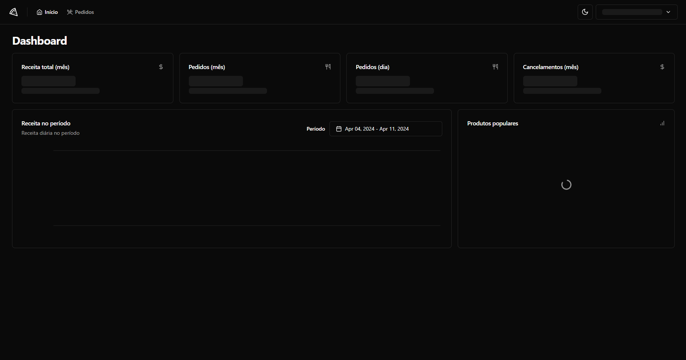
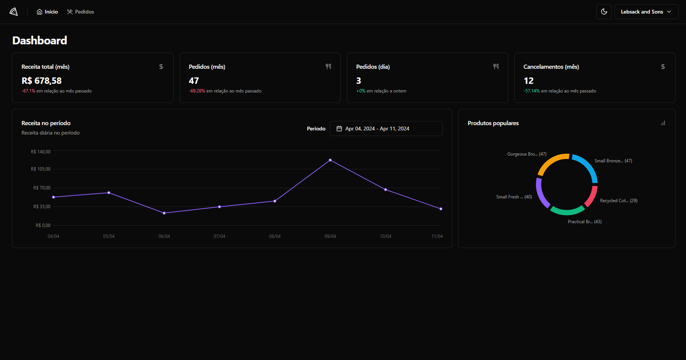
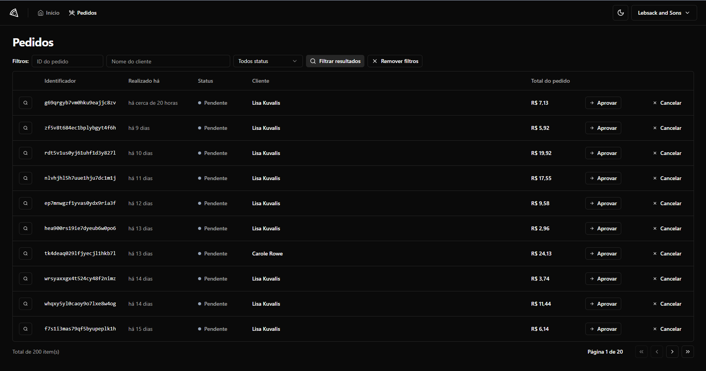
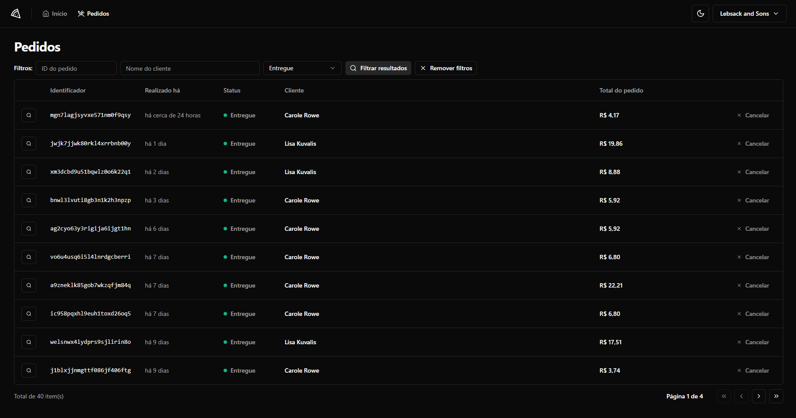
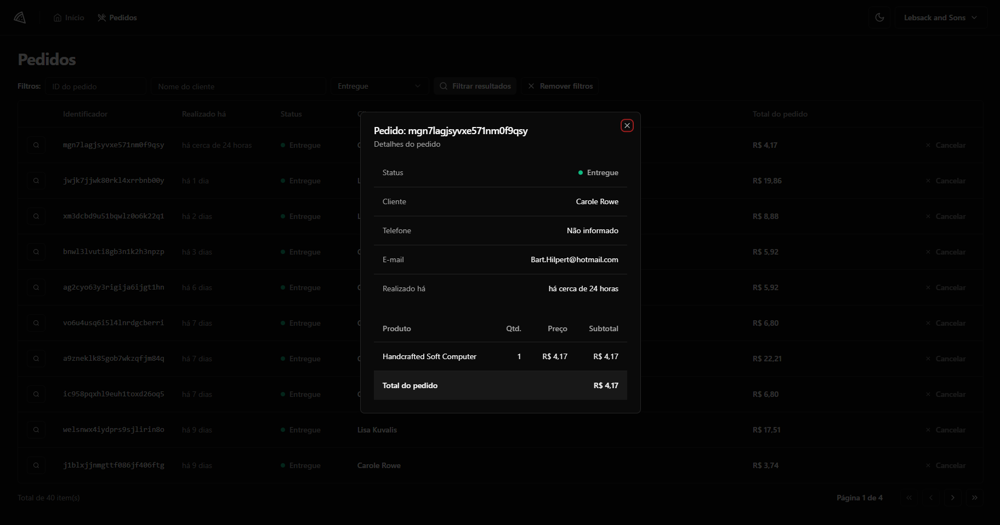
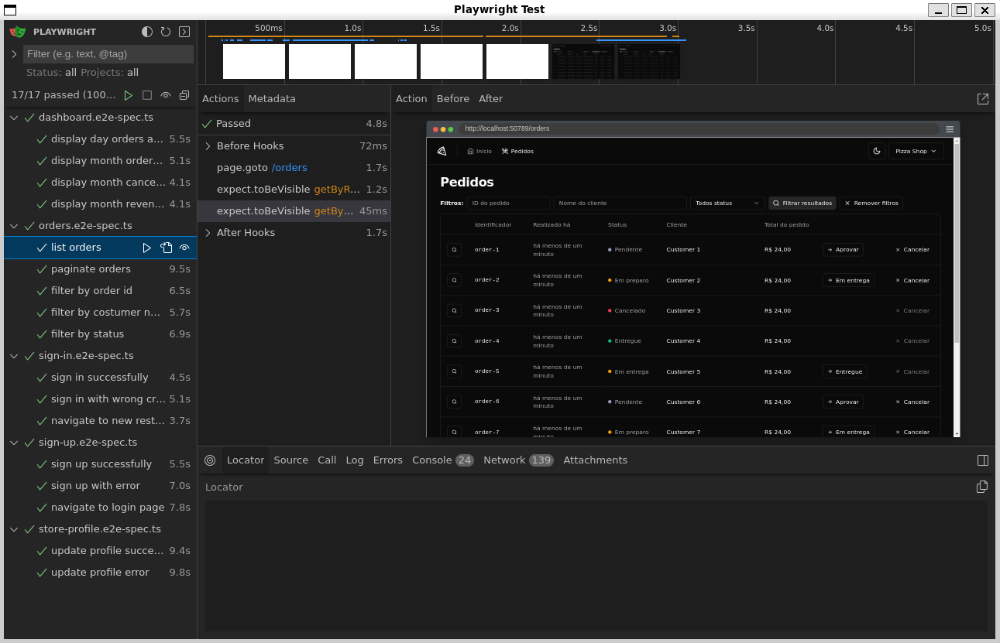

# PizzaShop

Este projeto foi desenvolvido em conjunto com a Rocketseat, onde o objetivo foi criar uma interface de um restaurante, sendo possível consultar o dashboard, com informações como a receita total do mês, pedidos do dia, um gráfico de produtos populares, e outros. Também é possível conferir a lista completa de pedidos, podendo alterar seu status, e conferir os detalhes do pedido, foram utilizados conceitos e ferramentas como TailWindCSS, Estados, Contextos, useForm, useQuery, axios para fazer as requisições HTTP ao backend, radix para criar um modal acessível, zod para validações além de implementar testes unitários com React Testing Library, e testes E2E utilizando MSW para criar os mocks da aplicação, e PlayWright para realizar os testes.

